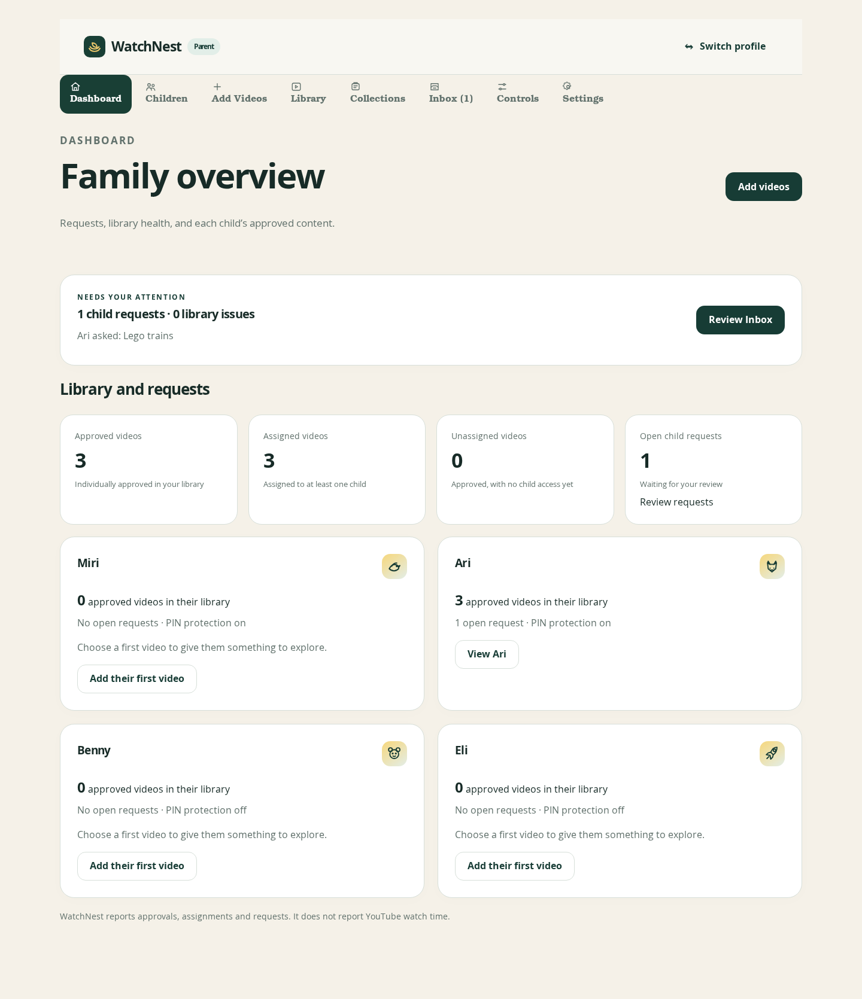
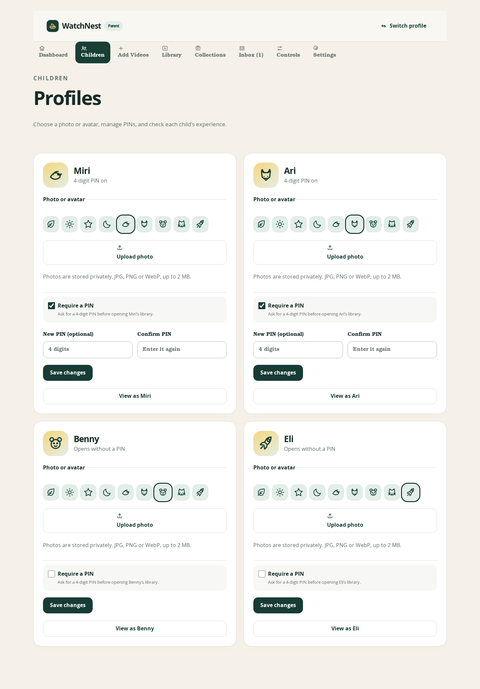
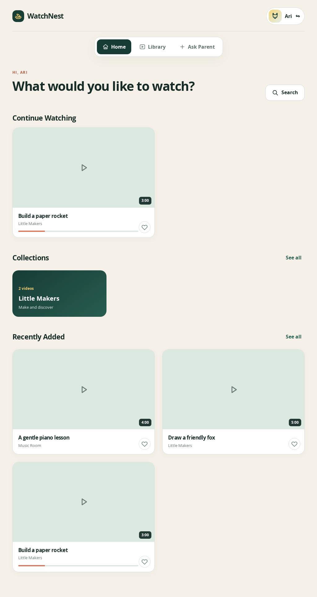
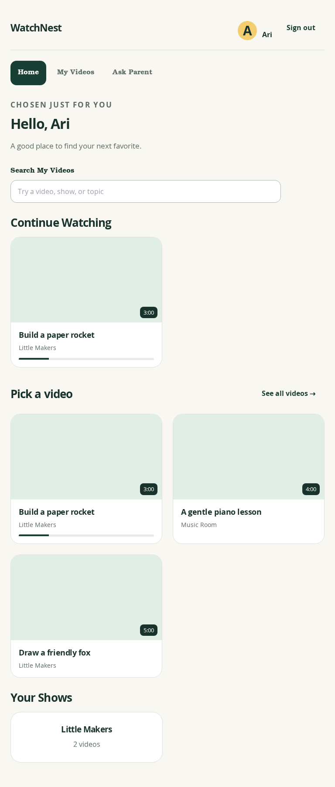

# WatchNest limited independent visual review — 2026-09-30

**Status: conditional visual review completed; full Stranger Test gate remains unassessed.** The four rendered screenshots are clear enough for Founder visual discussion. No P0 visual blocker is evident in these supplied states. This is not a product pass, live integration approval, accessibility certification, or certification of child safety.

## Scope and evidence limits

This independent review used the Stranger Test skill as a reporting framework, narrowed by the assignment to screenshot inspection only. No source was read or changed. The supplied images show actual browser-rendered UI backed by an explicitly **synthetic API fixture**, including empty video-thumbnail fixtures. No live backend or YouTube was exercised.

I inspected parent Overview, parent Children, standard child tablet Home, and simple child Home. I did not click controls, scroll a browser, test sign-in, save settings, switch profiles, play videos, measure CSS target sizes/contrast, or observe error/loading states. Screenshot heights are full-page captures, not evidence that all content fits the initial viewport. Touch reachability comments below concern visible placement and apparent control size; actual hit areas and device ergonomics require rendered interaction.

## Executive brief

The strongest feature is a consistent, calm visual hierarchy: dark primary actions, clearly selected navigation, readable child names, and large video cards. Parent and child surfaces feel related without exposing parent settings inside the child Home.

The most useful changes to consider are bringing pending parent work closer to the top of Overview, making the shared-device link explicitly shareable, and deciding whether simple mode should foreground immediate visual choice more strongly. These are product recommendations, not proven functional defects. Empty thumbnails substantially limit the younger-child comprehension review.

## Friction map

| ID | Classification / priority | Evidence and implication | Action / disposition |
| --- | --- | --- | --- |
| V1 | Strong UX recommendation / P1 | Overview places the detailed pending-work panel after four child cards and analytics. A busy parent can see `Inbox (1)` at the top, but the actionable explanation is near the page bottom. | Move a compact pending-work summary near the overview totals when attention is needed. Founder should judge. |
| V2 | Strong UX recommendation / P1 | Children tells the parent to “Share this link on the family iPad,” but shows only a raw URL and `Open child sign-in`. A visible copy/share action is absent. | Add `Copy child sign-in link` beside the open action, with success feedback. Verify this is not already available outside the screenshot. Founder should judge. |
| V3 | Founder judgment | Simple mode still opens with a greeting, supporting sentence, search, Continue Watching, and then the general video choices. This creates a long vertical route to some choices; Your Shows comes last. | Decide whether younger children should start with a compact resume choice and large video/show choices, with search secondary. Keep the current approach if independent younger-child use validates it. |
| V4 | Later / conditional observation | Parent profile identities all appear as blank mint squares despite `Leaf` being selected; the child Home uses a readable yellow `A`. The cause is unknown from images. | Recheck the intended identity artwork in a non-fixture rendering. If absent there too, make identities recognisable and consistent across profile selection and parent settings. Do not classify fixture absence as a source defect. |
| V5 | Later / beta observation | In simple Home, `Your Shows` exists far down the page while the top `Shows` navigation is removed. This may reduce discoverability for a child who recognises a show instead of a title. | Test a show-finding journey with a younger child before deciding whether to restore a large show entry point near the video choices. |
| V6 | Strong copy recommendation / P2 | Parent Overview uses `Eligible videos never watched`; the meaning of “eligible” is not apparent beside the number. The explanatory tracking caveat appears much farther down. | Use a more immediately understandable label or nearby short explanation of eligibility and counting. Founder should judge. |

There are **no independently established objective defects** in this screenshot-only review. The findings above must not be treated as approved implementation scope.

## Screen-by-screen review packet

### 1. Parent Overview

| Review field | Observation |
| --- | --- |
| Role / arrival | Returning parent; supplied screenshot, navigation path not exercised. |
| Purpose understood | Review family viewing activity and handle requests. |
| What works | Selected Overview tab is unmistakable. The Add videos action is prominent. Four summary numbers and named child cards are easy to scan. Tracking exclusions are disclosed in visible text. |
| Stranger friction | The largest element is a brand headline, while pending work appears last. `Eligible` needs interpretation. The empty Most watched panel consumes substantial vertical space for one item in this fixture. |
| Objective defects | None established. Data consistency and statistical accuracy were not assessed. |
| Recommendation | V1 and V6. Consider making Most watched compact when it contains only one item. |
| Disposition | Founder should judge information priority; keep clear child summaries. |
| Founder decision | [ ] Approve as is [ ] Approve recommendation [ ] Reject recommendation [ ] Modify/comment: ______ |

### 2. Parent Children

| Review field | Observation |
| --- | --- |
| Role / arrival | Parent configuring four children; supplied screenshot, navigation path not exercised. |
| Purpose understood | Set each child’s experience, identity, and passcode; launch child access. |
| What works | Independent sign-in instructions explain the parent/passcode distinction. Per-child Save settings is clear. “Leave blank to keep current” prevents an obvious passcode-edit ambiguity. Controls are visually spacious. |
| Stranger friction | The raw share URL requires the parent to infer copying. Four repeated expanded settings forms produce a long page; lower children’s Save/View controls require scrolling. Blank identity squares offer no visible recognition benefit. |
| Objective defects | None established; save behavior, passcode security, and hit areas were not tested. |
| Recommendation | V2; recheck V4. If frequent maintenance is cumbersome in interaction, consider compact child summaries with explicit editing rather than four permanently expanded forms. |
| Disposition | Founder should judge share-link clarity; later observation for settings density. |
| Founder decision | [ ] Approve as is [ ] Approve recommendation [ ] Reject recommendation [ ] Modify/comment: ______ |

### 3. Standard child tablet Home

| Review field | Observation |
| --- | --- |
| Role / arrival | Reading-age child, Ari; supplied screenshot, navigation path not exercised. |
| Purpose understood | Resume watching, search the approved library, or choose a recently added video. |
| What works | Child identity is visible. Search says `Search My Videos`, making its scope reasonably clear. Continue Watching is distinct from Recently Added. Large cards offer plausible touch targets; titles, creators, durations, and progress give useful cues. |
| Stranger friction | Actual thumbnail recognition cannot be evaluated. `See all videos` is a small text-style action compared with the cards; its real hit area is unknown. |
| Objective defects | None established. Card click behavior, search results, progress semantics, and sign-out recovery were not tested. |
| Recommendation | Keep the hierarchy pending real-thumbnail and touch interaction checks. Verify the text-style navigation and See all videos controls have comfortable touch hit areas. |
| Disposition | Keep as is provisionally; later/beta touch validation. |
| Founder decision | [ ] Approve as is [ ] Approve recommendation [ ] Reject recommendation [ ] Modify/comment: ______ |

### 4. Simple child Home

| Review field | Observation |
| --- | --- |
| Role / arrival | Younger child in simple experience; supplied screenshot, navigation path not exercised. |
| Purpose understood | Pick a large video card or resume a video, with fewer top-level choices. |
| What works | Cards are larger than in the standard screenshot, navigation has fewer choices, and `Pick a video` is direct language. The show card is a large, simple target. |
| Stranger friction | Choosing by reading remains necessary in the empty-thumbnail fixture. Search and greeting precede content; the final video and show choice are deep in the full-page capture. Touch reachability of upper navigation versus lower cards depends on actual device use. |
| Objective defects | None established. No younger-child journey or actual device test was performed. |
| Recommendation | V3 and V5. Require real visual thumbnails/recognisable show artwork before accepting independent use by pre-readers. |
| Disposition | Founder should judge simple-mode priority; interaction validation required. |
| Founder decision | [ ] Approve as is [ ] Approve recommendation [ ] Reject recommendation [ ] Modify/comment: ______ |

## Journey coverage record

No click-by-click journal is claimed: this assignment supplied still images only. All inferred screen purposes above are visual comprehension observations, not successful task completion. Parent onboarding, second-parent access, child sign-in, profile switching, request submission, approval, error recovery, playback, responsive layouts outside these captures, and live persistence remain unassessed.

## Founder review guide

1. Review Overview and decide whether handling pending work should precede analytics.
2. Review Children and decide whether the share-link instruction needs a direct copy action.
3. Compare standard and simple Home with actual thumbnails, then decide whether simple mode should place video/show choices earlier.
4. Before a full product verdict, exercise the omitted journeys in a rendered browser with synthetic accounts, including comfortable touch targets, actual initial viewports, save feedback, child access, and recovery. Validate live integrations separately.

**Conditional disposition:** suitable as a limited visual input to Founder Review. The mandatory full Stranger Test gate cannot pass on these four screenshots alone.

## Product-team disposition — implemented following independent review

The delegated product organization accepted V1 and V2 as routine improvements: Overview now brings pending requests and library issues into a compact actionable summary near the totals, only when needed. Children now offers a copy-link control with status feedback and a selectable-link fallback when clipboard access fails. No credentials are copied. Eligible-video metrics now explain their audience-status limitations beside the totals. Parent profile identities use recognizable initials to avoid missing emoji artwork.

These changes preserve the independent screenshot findings above; the original inspection did not assess their revised rendered states. They require a fresh browser interaction check and do not establish live integration acceptance or iPad certification.
